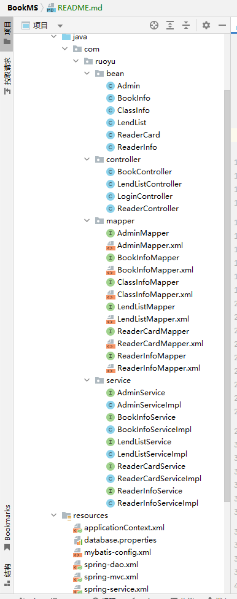
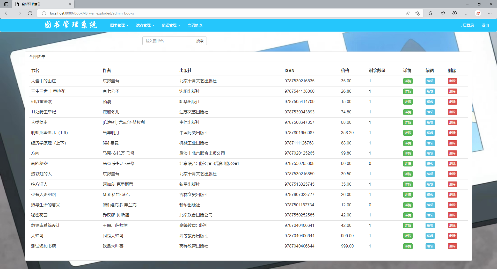
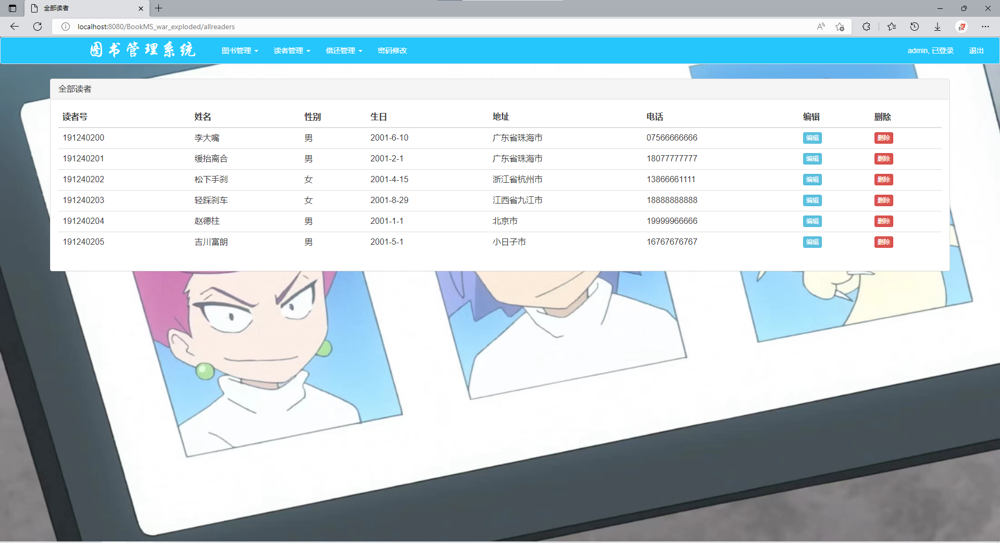
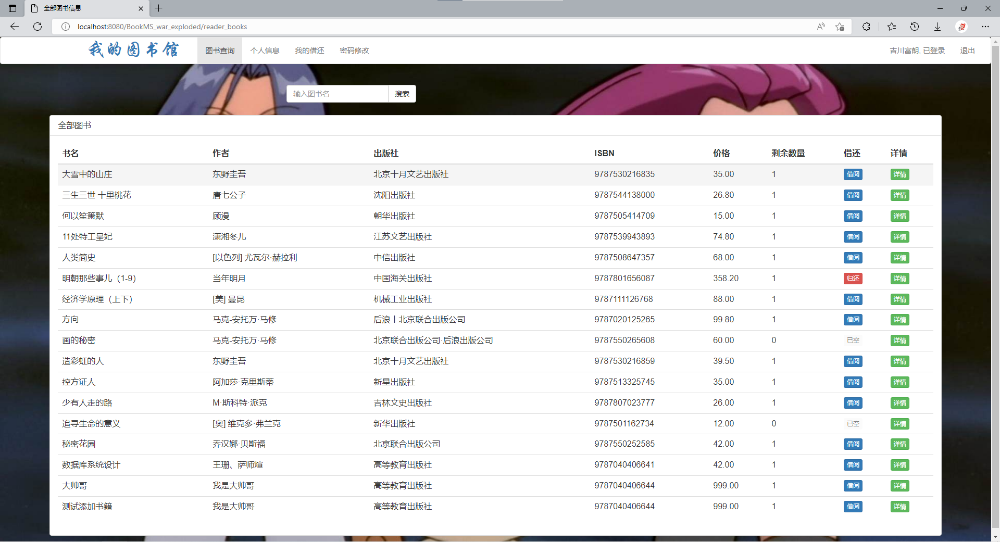

# 图书馆管理系统

## 开发环境
- JDK版本：1.8.0_333
- 数据库版本：Mysql 8.0.27
- IDEA版本：2022.1.3

## 项目结构

### 文件结构：
- bean：对象
- controller：控制层
- mapper：持久层
- service：服务层

- 

### 项目展示

#### 管理员页面

#### 

#### 

#### 

#### 读者页面

#### 

#### 

#### 

#### 

### 数据库
共有6个表：

#### 1. 图书书目表book_info
| 名           | 类型    | 长度 | 小数点 | NULL | 用途     | 键   |
| :----------- | :------ | ---- | ------ | ---- | -------- | ---- |
| book_id      | bigint  | 20   | 0      | 否   | 图书号   | ✔    |
| name         | varchar | 20   | 0      | 否   | 书名     |      |
| author       | varchar | 15   | 0      | 否   | 作者     |      |
| publish      | varchar | 20   | 0      | 否   | 出版社   |      |
| ISBN         | varchar | 15   | 0      | 否   | 标准书号 |      |
| introduction | text    | 0    | 0      | 是   | 简介     |      |
| language     | varchar | 4    | 0      | 否   | 语言     |      |
| price        | decimal | 10   | 2      | 否   | 价格     |      |
| pub_date     | date    | 0    | 0      | 否   | 出版时间 |      |
| class_id     | int     | 11   | 0      | 是   | 分类号   |      |
| number       | int     | 11   | 0      | 是   | 剩余数量 |      |

#### 2. 数据库管理员表admin
| 名       | 类型    | 长度 | 小数点 | NULL | 用途   | 键   |
| :------- | :------ | ---- | ------ | ---- | ------ | ---- |
| admin_id | bigint  | 20   | 0      | 否   | 账号   | ✔    |
| password | varchar | 15   | 0      | 否   | 密码   |      |
| username | varchar | 15   | 0      | 是   | 用户名 |      |

#### 3. 图书分类表class_info
| 名         | 类型    | 长度 | 小数点 | NULL | 用途   | 键   |
| :--------- | :------ | ---- | ------ | ---- | ------ | ---- |
| class_id   | int     | 11   | 0      | 否   | 类别号 | ✔    |
| class_name | varchar | 15   | 0      | 否   | 类别名 |      |

#### 4. 借阅信息表lend_list
| 名        | 类型   | 长度 | 小数点 | NULL | 用途     | 键   |
| :-------- | :----- | ---- | ------ | ---- | -------- | ---- |
| ser_num   | bigint | 20   | 0      | 否   | 流水号   | ✔    |
| book_id   | bigint | 20   | 0      | 否   | 图书号   |      |
| reader_id | bigint | 20   | 0      | 否   | 读者证号 |      |
| lend_date | date   | 0    | 0      | 是   | 借出日期 |      |
| back_date | date   | 0    | 0      | 是   | 归还日期 |      |

#### 5. 借阅卡信息表reader_card
| 名        | 类型    | 长度 | 小数点 | NULL | 用途     | 键   |
| :-------- | :------ | ---- | ------ | ---- | -------- | ---- |
| reader_id | bigint  | 20   | 0      | 否   | 读者证号 | ✔    |
| password  | varchar | 15   | 0      | 否   | 密码     |      |
| username  | varchar | 15   | 0      | 是   | 用户名   |      |

#### 6. 读者信息表reader_info
| 名        | 类型    | 长度 | 小数点 | NULL | 用途     | 键   |
| :-------- | :------ | ---- | ------ | ---- | -------- | ---- |
| reader_id | bigint  | 20   | 0      | 否   | 读者证号 | ✔    |
| name      | varchar | 10   | 0      | 否   | 姓名     |      |
| sex       | varchar | 2    | 0      | 否   | 性别     |      |
| birth     | date    | 0    | 0      | 否   | 生日     |      |
| address   | varchar | 50   | 0      | 否   | 地址     |      |
| phone     | varchar | 15   | 0      | 否   | 电话     |      |